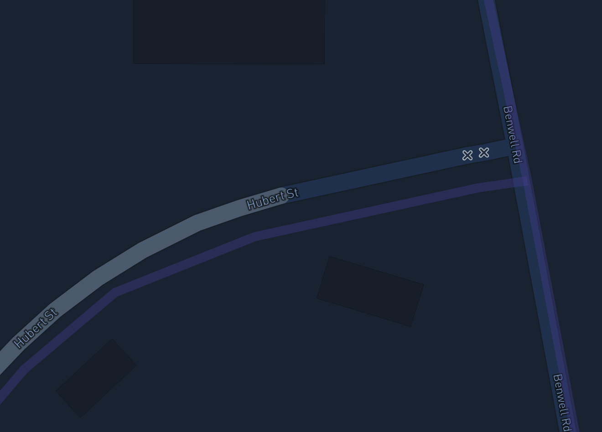

# Topomapper

## Description

As part of a larger research project, this mobile friendly web application documents the commemorative work done through the street naming in Townsville, QLD (Australia). Sparked by work in critical toponymy that highlights the selective comemorative work done through the mundane naming practices of civic space ([Azaryahu, 1996](https://journals.sagepub.com/doi/pdf/10.1068/d140311); [Berg & Vuolteenaho, 2009](https://books.google.com.au/books/about/Critical_Toponymies.html?id=xg1GAepFft8C&redir_esc=y); [Rose-Redwood, 2016](https://www.acme-journal.org/index.php/acme/article/view/1215); [Smith, 2018](https://www.tandfonline.com/doi/abs/10.1080/00377996.2018.1460569)), this web application seeks to surface the people, events and moments remembered across the city's geography.


## Project Details

### Progress

__Townsville__

The following suburbs have been mapped:
- Belgian Gardens
- North Ward
- South Townsville
- Townsville City
- West End

Next up:
- Nothing for now.

NOTE: Efforts to map will slow down adding new streets as each of the five suburbs above will be cleaned up, proofed and filled out with further context.

__Cairns__

This is a new avenue for work and some of the groundwork for it is only being laid now. Suburbs covered include the following possibilities:
- Bungalow
- Cairns City
- Cairns North
- Manunda
- Parramatta Park
- Portsmith
- Westcourt

### Viewing

Interested in viewing the application? Visit [here](https://bryanabsmith.com/topomapper/).

### Browser support

The application is developed and tested in Firefox (68+) and Chrome (78+) but has been tested on and is thought to work with the following (with little to no errors).

#### Desktop
- Firefox (68+)
- Chrome (74+)
- Safari (12.1.1+)
- Edge "Legacy" (44+)
    - NOTE: getting street information is frustrating (the clickable space for the street layer seems to be minimal relative to other browsers).
    - NOTE: Testing with "legacy" Edge (ie. non-Chromium based builds) will no longer take place (or will only be done so very infrequently).
- Edge "Chromium" (79+)

#### Mobile
- Safari (iOS, 12.3.1)
- Chrome (Android, 74)

It is possible (and likely for those that aren't much older than these) that it will work with older browsers and those not listed here.

## Known Issues

### Street Level Data
- None as of yet. The only known issue is an ongoing one: the changes in OSM data means that the mapping of GeoJSON data may not be perfect. An example of this can be seen below.

.

The ever shifting OSM and Mapbox data means that this will be an issue for the foreseeable future.

## Development
Want to work on Topomapper? The instructions below will set you up for development.

### Set up the environment
As a web application that is written in HTML, CSS, and JS, the app can simply be made available on a web server. If you don't have a web server available, or you don't want to set one up, a debugging server written in Python is provided as part of the code here. To run it, you first need to install Python.

#### Installing Python
If you're running this on a Mac or Linux box, you've already got Python installed. Simply execute the following at the command line.

##### macOS
Open /Applications/Terminal.app and run the follwing (type it and press enter):

    cd <path to where Topomapper is> && python3 debug_server.py

##### Linux
Open up a command line prompt (gnome-terminal or Konsole for example) and run the following:

    cd <path to where Topomapper is> && python3 debug_server.py

##### Windows
First, you will need to install Python. Download it from [here](https://www.python.org/downloads/windows/).

Second, open up a command prompt. To do this, press the Windows Key + R and enter ***cmd.exe*** (press enter). In the window that appears, type the following:

    cd <path to where Topomapper is>

Next, run the following:

    python debug_server.py

### Install/deploy on your own server (this also includes local development)

1. Clone the code

    ``` git clone https://github.com/bryan-ab-smith/topomapper.git```

2. Get a MapBox token. See [here](https://account.mapbox.com/access-tokens/) for more information (you will need to sign up for a MapBox account if you don't already have one). Add this to js/mapbox.js.template as the value for the mbToken variable.

3. There are two map styles - one satellite and one "light." In mapbox.js.template, there is a variable for each (mbStyleLight and mbStyleSat). Ultimately, the style doesn't matter but note that the light variant is the default. You can get and generate styles [here](https://www.mapbox.com/mapbox-studio/) using MapBox Studio. Once you've generated/created a style, copy the style url (eg. mapbox://...) to the appropriate variables in mapbox.js.template.

4. Rename js/mapbox.js.template to js/mapbox.js.

5. Upload everything to your web server and everything should work. You can also run the local debug server here.


#### Other options

Anything really. A quick and simple alternative to the included debug server might be something like [serve](https://www.npmjs.com/package/serve):

    $ npm install -g serve
    $ cd /path/to/topomapper/
    $ serve

## License

### Everything that isn't the GeoJSON data (see below).

MIT License

Copyright (c) 2019-2023 Bryan Smith.

Permission is hereby granted, free of charge, to any person obtaining a copy
of this software and associated documentation files (the "Software"), to deal
in the Software without restriction, including without limitation the rights
to use, copy, modify, merge, publish, distribute, sublicense, and/or sell
copies of the Software, and to permit persons to whom the Software is
furnished to do so, subject to the following conditions:

The above copyright notice and this permission notice shall be included in all
copies or substantial portions of the Software.

THE SOFTWARE IS PROVIDED "AS IS", WITHOUT WARRANTY OF ANY KIND, EXPRESS OR
IMPLIED, INCLUDING BUT NOT LIMITED TO THE WARRANTIES OF MERCHANTABILITY,
FITNESS FOR A PARTICULAR PURPOSE AND NONINFRINGEMENT. IN NO EVENT SHALL THE
AUTHORS OR COPYRIGHT HOLDERS BE LIABLE FOR ANY CLAIM, DAMAGES OR OTHER
LIABILITY, WHETHER IN AN ACTION OF CONTRACT, TORT OR OTHERWISE, ARISING FROM,
OUT OF OR IN CONNECTION WITH THE SOFTWARE OR THE USE OR OTHER DEALINGS IN THE
SOFTWARE.

### Note about the street GeoJSON data
The GeoJSON co-ordinate data (datafiles/) and the [tsv/cns].geojson "master" files come from OpenStreetMap (by way of Overpass Turbo). That data is available under the Open Database License (see [here](https://opendatacommons.org/licenses/odbl/1-0/)).
