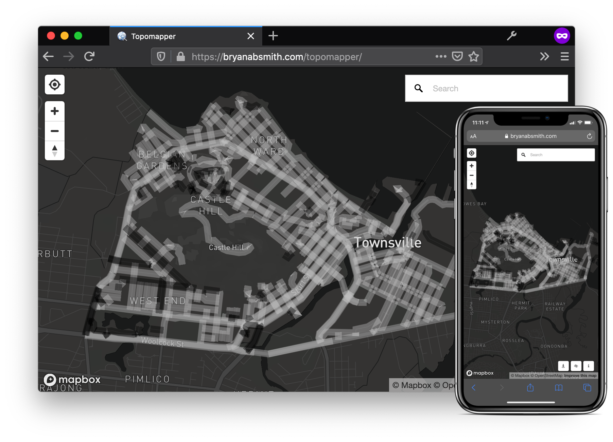

## Topomapper

### Description

As part of a larger research project, this mobile friendly web application documents the namesakes of streets in Townsville, QLD (Australia). Built on the premise that street names normalises particular colonial commemorative practices, this application is meant to surface the narrative woven through the naming practices of a small regional Queensland city as a demonstration of the powerful colonial commemoration written into the cartography of settler communities.



### Install/deploy on your own server

1. Clone the code

    ``` git clone https://github.com/bryan-ab-smith/topomapper.git```

2. Get a MapBox token. See [here](https://account.mapbox.com/access-tokens/) for more information (you will need to sign up for a MapBox account if you don't already have one). Add this to js/mapbox.js.template as the value for the mbToken variable.

3. There are two map styles - one satellite and one "light." In mapbox.js.template, there is a variable for each (mbStyleLight and mbStyleSat). Ultimately, the style doesn't matter but note that the light variant is the default. You can get and generate styles [here](https://www.mapbox.com/mapbox-studio/) using MapBox Studio. Once you've generated/created a style, copy the style url (eg. mapbox://...) to the appropriate variables in mapbox.js.template.

4. Rename js/mapbox.js.template to js/mapbox.js.

5. Upload everything to your web server and everything should work.

### License

MIT License

Copyright (c) 2019 Bryan Smith

Permission is hereby granted, free of charge, to any person obtaining a copy
of this software and associated documentation files (the "Software"), to deal
in the Software without restriction, including without limitation the rights
to use, copy, modify, merge, publish, distribute, sublicense, and/or sell
copies of the Software, and to permit persons to whom the Software is
furnished to do so, subject to the following conditions:

The above copyright notice and this permission notice shall be included in all
copies or substantial portions of the Software.

THE SOFTWARE IS PROVIDED "AS IS", WITHOUT WARRANTY OF ANY KIND, EXPRESS OR
IMPLIED, INCLUDING BUT NOT LIMITED TO THE WARRANTIES OF MERCHANTABILITY,
FITNESS FOR A PARTICULAR PURPOSE AND NONINFRINGEMENT. IN NO EVENT SHALL THE
AUTHORS OR COPYRIGHT HOLDERS BE LIABLE FOR ANY CLAIM, DAMAGES OR OTHER
LIABILITY, WHETHER IN AN ACTION OF CONTRACT, TORT OR OTHERWISE, ARISING FROM,
OUT OF OR IN CONNECTION WITH THE SOFTWARE OR THE USE OR OTHER DEALINGS IN THE
SOFTWARE.
